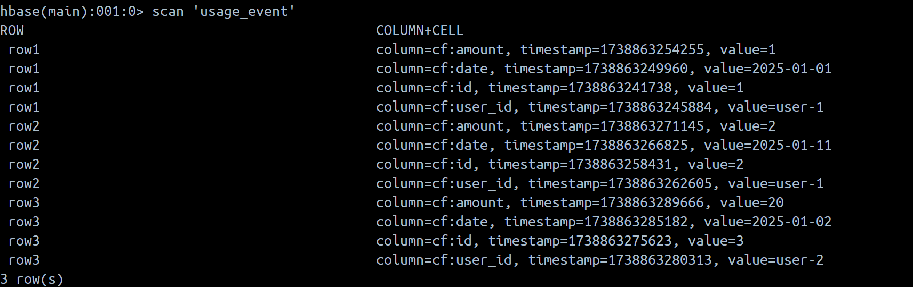
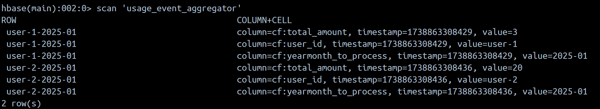
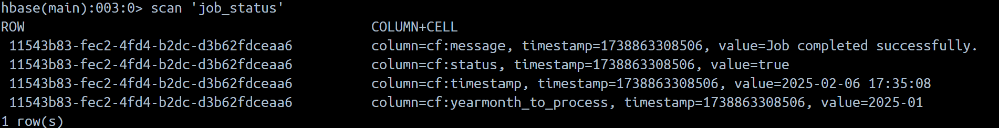

# UsageEventAggregator

## Overview
`UsageEventAggregator` is a Java-based program designed to aggregate usage events from an HBase table using Apache Spark. It reads data from a specified HBase table, processes it to compute the total usage amount per user, and writes the aggregated results back to another HBase table.

The program is built using:
- **Apache Spark**: For distributed data processing.
- **Apache HBase**: For data storage and retrieval.
- **SLF4J**: For logging.

## Features
- Connects to and reads data from an HBase table `usage_event`.
- Uses Spark to process and transform large datasets.
- From `usage_event`, filters data by a specified date. Date is an argument when perform spark-submit
- From `usage_event` aggregates usage events by `user_id` and computes the total `amount`.
- Inserts aggregated results into an output table `usage_event_aggregator`.
- Captures and logs job status (success or failure) in a dedicated `job_status` table.

---

## How It Works
1. **Initialization**:
    - Loads configurations from a file (`config.properties`).
    - Initializes an Apache Spark session and an HBase connection.

2. **Reading Data**:
    - Fetches usage events, from the input `usage_event` table.
    - Extracts fields such as `id`, `user_id`, `date`, and `amount`.

3. **Filtering and Processing**:
    - Filters events based on the date specified from program argument.
    - Groups the events by `user_id` and computes the total usage amount per user.

4. **Writing Results**:
    - Writes the aggregated data back to the output `usage_event_aggregator` table.

---
### Directory Guide

    .
    ├── src
    │   ├── main
    │       └── resources
    |             └── config.properties # to define spark master
    |             └── hbase-site.xml # Hbase connection details
    ├── init-hbase.sh  # Script to insert test data

---

### Table Description

 Table                  | Description                                          |
------------------------|------------------------------------------------------|
 usage_event            | Contains usage record of user                        |
 usage_event_aggregator | Contains aggregated usage record by user-id          |
 job_status             | Contains job status record, either success or failed |

---

### Database table

#### usage_event (source)



#### usage_event_aggregator (output)



#### job_status (monitoring)



---

## Prerequisites

- Docker installed on your system.
- `docker-compose.yml` and `hbase-init.sh` files in the same directory.

---
## Steps to Run

### 1. Package the java file

```bash
mvn clean package
```

### 2.  Build and Start the Cluster
Run the following command in the directory containing the docker-compose.yml file:

```bash
docker-compose up -d
```

### 3. Insert test data
Execute the hbase-init.sh script inside the container:

```bash
docker exec -it hbase /bin/bash -c "/usr/local/bin/init-hbase.sh"
```

### 4. Submit the Spark Job
Note: 2025-01 is example month to process
```bash
docker exec -it spark-submitter /opt/bitnami/spark/bin/spark-submit --class personal.syaz.UsageEventAggregatorJob --master spark://spark-master:7077 --conf "spark.hadoopRDD.ignoreEmptySplits=false" /opt/spark-apps/usage-event-aggregator-1.0-SNAPSHOT.jar 2025-01
```